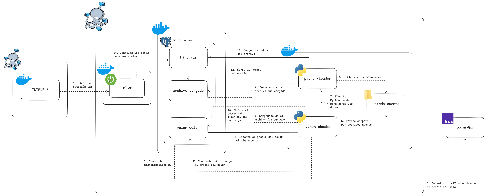
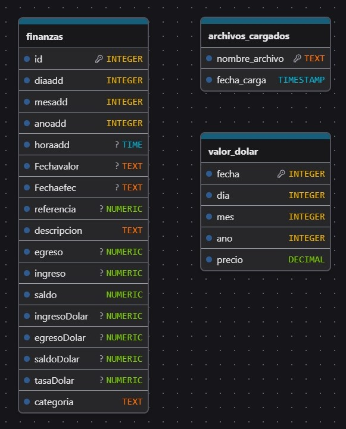

# Introducción
Al enfrentar la vida de adulto me he encontrado con la necesidad de llevar de manera organizada la información sobre mis ingresos y gastos. Intenté con aplicaciones en android para llevar estos registros, sin embargo, soy muy vago para ir registrando todos los movimientos financieros que pasan por mi cuenta.

Así que, aprovechando que soy informático —y que nuestra existencia se basa en automatizar procesos, incluso los más banales— decidí crear este proyecto.

Como punto de partida, utilizaré los Estados de Cuenta que cualquier banco permite descargar. En mi caso, el banco entrega estos archivos en formatos PDF, Excel y TXT. Elegí el **TXT**, ya que es el más fácil de procesar automáticamente. Cada mes, el archivo se descarga y se renombra bajo el formato `mes-año.txt` (por ejemplo: `mayo-2025.txt`), lo cual permite ubicarlo y cargarlo fácilmente.

El objetivo de este proyecto es automatizar la carga de los estados de cuenta a una base de datos, para luego ser consultados desde una API y mostrarlos mediante interfaces como una aplicación web o móvil.

---

# Arquitectura General
- [Base de Datos PostgreSQL](#base-de-datos): almacena los registros financieros, archivos cargados y valor del dólar diario.
- [Servicio en Python (demonio)](./carga-datos/): se ejecuta como un proceso persistente que revisa continuamente si hay archivos nuevos para cargar y si ya se registró el valor del dólar del día.
- [Script de carga `python-loader.py`](./carga-datos/): se encarga de procesar los archivos `.txt` y cargar los datos a la base.
- [API REST en Spring Boot](./api/): permite consultar los datos almacenados.
- (Pendiente) Frontend Web o Android: interfaz de visualización.

---

# Diagrama del funcionamiento
Este es una representación en Diagrama del funcionamiento completo del sistema (Dar click para ver mejor).

---

# Base de Datos
La base de datos es PostgreSQL, ya que se integra muy bien con Spring Boot y tiene excelente soporte en Python. Está contenida en un servicio Docker junto con `pgAdmin` para su gestión visual.

Actualmente el sistema cuenta con tres tablas principales:
1. **finanzas:** Almacena los movimientos financieros obtenidos desde los estados de cuenta.
   - id
   - diaadd (Dia que se agrega el registro)
   - mesadd (Mes que se agrega el registro)
   - anoadd (Año que se agrega el registro)
   - horaadd (Hora que se agrega el registro)
   - Fechavalor (Fecha que se efectua la transacción)
   - Fechaefec (Fecha que se efectuo según el banco)
   - Referencia (Número de referencia de la transacción)
   - descripcion (Descripción de la transacción)
   - egreso (Monto si fue un gato)
   - ingreso (Monto si entro dinero en mi cuenta)
   - Saldo (El saldo que tenia la cuenta al momento de la transacción)
   - ingresoDolar (Valor equivalente en dolares)
   - egresoDolar (Valor equivalente en dolares)
   - saldoDolar (Saldo equivalente en dolares)
   - tasaDolar (La tasa utilizada para calcular los valores anteriores)
   - Categoria (Para agrupar mismos gastos o ganancias y diferenciarlos más facil)
2. **archivos_cargados:** Registra los archivos ya procesados, para evitar cargas duplicadas.
   - nombre_archivo
   - fecha_carga
3. **valor_dolar:** Tabla auxiliar que guarda el valor del dólar del día según una API externa.
   - fecha
   - dia
   - mes
   - año
   - valor
>Se utiliza esta tabla para convertir los montos de bolívares a dólares al momento de la carga.

---

© 2025 - Proyecto EDC